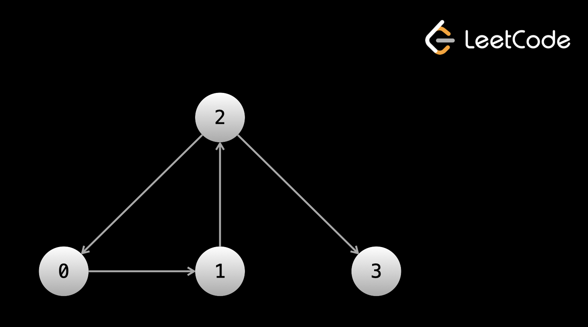
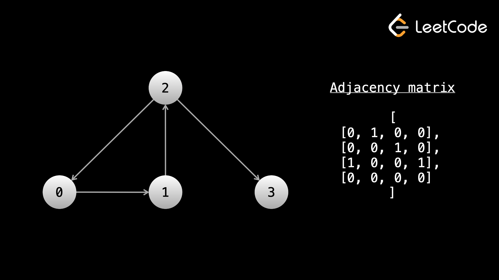

# [One Week Study Guide](readme.md)

## General Notes

### Prefix Sum

A prefix sum array for `nums` is another array prefixSum of the same size as `nums`, such that the value of `prefixSum[i]` is the sum of all elements of the `nums` array from index 0 to index i, i.e., `nums[0] + nums[1] + nums[2] + . . . + nums[i]`. The sum of the subarray `i + 1` to `j` (inclusive) is computed by `prefixSum[j] - prefixSum[i]`.

### Trees

A "complete" binary tree is one where every level (except possibly the last) is full, and all the nodes in the last level are as left as possible.

From <https://leetcode.com/explore/interview/card/leetcodes-interview-crash-course-data-structures-and-algorithms/707/traversals-trees-graphs/4619/>

- In an interview, you may be asked some trivia regarding BFS vs DFS, such as their drawbacks.

  - The main disadvantage of DFS is that you could end up wasting a lot of time looking for a value.
  - Let's say that you had a huge tree, and you were looking for a value that is stored in the root's right child. If you do DFS prioritizing left before right, then you will search the entire left subtree, which could be hundreds of thousands if not millions of operations. Meanwhile, the node is literally one operation away from the root.
  - The main disadvantage of BFS is that if the node you're searching for is near the bottom, then you will waste a lot of time searching through all the levels to reach the bottom.

From <https://leetcode.com/explore/interview/card/leetcodes-interview-crash-course-data-structures-and-algorithms/707/traversals-trees-graphs/4619/>

- In terms of space complexity,

  - DFS uses space linear with the height of the tree (the maximum depth), whereas
  - BFS uses space linear with the level that has the most nodes.
  - In some cases, DFS will use less space, in other cases, BFS will use less.

- For example, in a perfect binary tree,
  - DFS would use O(log⁡n)O(logn) space, whereas
  - BFS would use O(n)O(n).
  - The final level in a perfect binary tree has n22n​ nodes, but the tree only has a depth of log⁡nlogn.
- However, if you have a lopsided tree (like a straight line), then
  - BFS will have an O(1)O(1) space complexity while
  - DFS will have O(n)O(n) (although, a lopsided tree is an edge case whereas a more full tree is the expectation).

From <https://leetcode.com/explore/interview/card/leetcodes-interview-crash-course-data-structures-and-algorithms/707/traversals-trees-graphs/4619/>

#### Depth First Search

DFS is implemented using a stack (recursion uses a stack under the hood)

```Python
def dfs(node):
    if node == None:
        return

    dfs(node.left)
    dfs(node.right)
    return
```

#### Breath First Search

Standard BFS implementation

```Python
from collections import deque

def print_all_nodes(root):
    queue = deque([root])
    while queue:
        nodes_in_current_level = len(queue)
        # do some logic here for the current level

        for _ in range(nodes_in_current_level):
            node = queue.popleft()

            # do some logic here on the current node
            print(node.val)

            # put the next level onto the queue
            if node.left:
                queue.append(node.left)
            if node.right:
                queue.append(node.right)
```

- BFS is implemented iteratively with a queue.

  - You can implement BFS with recursion, but it wouldn't make sense as it's a lot more difficult without any benefit.
  - As such, we will look only at iterative implementations in this course.

> With an efficient queue, the dequeue and enqueue operations are O(1)O(1), which means that the time complexity of BFS is the same as DFS. Again, the main idea is that we visit each node only once, so the time complexity is O(n⋅k)O(n⋅k) where nn is the total number of nodes, and kk is the amount of work we do at each node, usually O(1)O(1). Let's look at some example problems.

From < <https://leetcode.com/explore/interview/card/leetcodes-interview-crash-course-data-structures-and-algorithms/707/traversals-trees-graphs/4619/>>

#### Binary Search

> A binary search tree (BST) is a type of binary tree. A BST has the following property:
> For each node, all values in its left subtree are less than the value in the node, and all values in its right subtree are greater than the value in the node.
> This property also implies that values in a BST must be unique.

From < <https://leetcode.com/explore/interview/card/leetcodes-interview-crash-course-data-structures-and-algorithms/707/traversals-trees-graphs/4622/>>

> With a binary search tree, operations like searching, adding, and removing can be done in O(log⁡n)O(logn) time on average, where nn is the number of nodes in the tree, using something called binary search, which is the focus of an upcoming chapter.

From < <https://leetcode.com/explore/interview/card/leetcodes-interview-crash-course-data-structures-and-algorithms/707/traversals-trees-graphs/4622/>>

### Graphs

A graph is any collection of nodes and connections between those nodes.
Another term for nodes is vertices, and the connections between the nodes are called edges.

From < <https://leetcode.com/explore/interview/card/leetcodes-interview-crash-course-data-structures-and-algorithms/707/traversals-trees-graphs/4721/>>

Remember that a binary tree is a graph, it just has a lot of restrictions on it. The most prominent ones are that every node has at most one parent and at most two children. When we lift the restrictions, graphs can take many more forms.

From < <https://leetcode.com/explore/interview/card/leetcodes-interview-crash-course-data-structures-and-algorithms/707/traversals-trees-graphs/4721/>>

Edges of a node can either be directed or undirected. Directed edges mean that you can only traverse in one direction. In graphical representations, undirected edges will just be straight lines between nodes.

From < <https://leetcode.com/explore/interview/card/leetcodes-interview-crash-course-data-structures-and-algorithms/707/traversals-trees-graphs/4721/>>

In binary trees, the edges were directed. Binary trees are directed graphs. You can't access a node's parent, only its children. Once you move to a child, you can't move back.

Another important term is connected component. A connected component of a graph is a group of nodes that are connected by edges. In binary trees, there must only be one connected component (all nodes are reachable from the root).

A node can have any number of edges connected to it. If we have a directed graph, it can have any number of edges leaving it and any number of edges entering it. The number of edges that can be used to reach the node is the node's indegree. The number of edges that can be used to leave the node is the node's outdegree. Nodes that are connected by an edge are called neighbors. So if you have a graph like A <-> B <-> C, A is neighbors with B, B is neighbors with A and C, and C is neighbors with B.

In binary trees, all nodes except the root had an indegree of 1 (due to their parent). All nodes have an outdegree of 0, 1, or 2. An outdegree of 0 means that it is a leaf. Specific to trees, we used the parent/child terms instead of "neighbors".

A graph can be either cyclic or acyclic. Cyclic means that the graph has a cycle, acyclic means that it doesn't. We learned what a cycle was in the linked list chapter - it's when you have a path in the edges that leads to visiting the same nodes infinitely.

Binary trees by definition cannot have a cycle.

In linked list problems, the head of the linked list is given. In binary tree problems, the root of the tree is given. In graph problems, only information about a graph is given. There are multiple common formats that this information can come in.

An important thing to understand is that with linked lists and binary trees, you are literally given objects in memory that contain data and pointers. With graphs, the graph doesn't literally exist in memory.

In fact, only the "idea" of the graph exists. The input will give you some information about it, and it's up to you to figure out how to represent and traverse the graph with code.

Many times, the nodes of a graph will be labeled from 0 to n - 1. The problem statement may or may not explicitly state the input is a graph. Sometimes there might be a story, and you need to determine that the input is a graph. For example, "there are n cities labeled from 0 to n - 1". You can treat each city as a node and each city has a unique label.

With binary trees, traversal was easy because at any given node, we only needed to reference node.left and node.right. This allowed us to focus only on the traversal (with DFS or BFS). With graphs, a node can have any number of neighbors. Before we start our traversal, we usually need to do some work to make sure that for any given node, we can immediately access all the neighbors of said node.

#### **First input format:** array of edges (see [number of connected components](solutions/number-of-connected-components.md))

So, why can't we immediately start traversal? Let's say that we want to start a DFS from node 0 (sometimes the problem will state which node you should start from, sometimes you will need to figure this out yourself). When we're at node 0, how do we find the neighbors? We would need to iterate over the entire input to find all edges that include 0. When we move to a neighbor node, we would need to iterate over the entire input again to find all the neighbors of that node.

At every node, we would need to iterate over the entire input to find the neighbors. This is very slow!

Before starting the traversal, we can pre-process the input so that we can easily find all neighbors of any given node. Ideally, you want a data structure where you can give node as an argument and be returned a list of neighbors. The easiest way to accomplish this is using a hash map.

Let's say you had a hash map graph that mapped integers to lists of integers. We can iterate over the input and for each [x, y] pair, we can put y in the list associated with graph[x]. If the edges are undirected, we will also need to put x in the list associated with graph[y]. After building this hash map, we can do graph[0] and immediately have all the neighbors of node 0.



This example graph can be represented by an array of directed edges: edges = [[0, 1], [1, 2], [2, 0], [2, 3]].

Notice that the graph in the image does not exist in memory. It exists only as an idea derived from the array [[0, 1], [1, 2], [2, 0], [2, 3]].

Here's some example code for building graph from an array of edges:

```Python
from collections import defaultdict

def build_graph(edges):
    graph = defaultdict(list)
    for x, y in edges:
        graph[x].append(y)
        # graph[y].append(x)
        # uncomment the above line if the graph is undirected

    return graph
```

#### **Second input format:** adjacency list

In an adjacency list, the nodes will be numbered from 0 to n - 1. The input will be a 2D integer array, let's call it graph. graph[i] will be a list of all the outgoing edges from the ith node.

The graph in the image above can be represented by the adjacency list graph = [[1], [2], [0, 3], []].

Notice that with this input, we can already access all the neighbors of any given node. We don't need to do any pre-processing! This makes an adjacency list the most convenient format. If we want all the neighbors of node 6, we just check graph[6].

#### **Third input format:** adjacency matrix (see [number of provinces](solutions/number-of-provinces.md))

The next format is an adjacency matrix. Once again, the nodes will be numbered from 0 to n - 1. You will be given a 2D matrix of size n x n, let's call it graph. If graph[i][j] == 1, that means there is an outgoing edge from node i to node j.



When given this format, you have two options. During the traversal, at any given node you can iterate over graph[node], and if graph[node][i] == 1, then you know that node i is a neighbor. Alternatively, you can pre-process the graph as we did with an array of edges. Build a hash map and then iterate over the entire graph. If graph[i][j] == 1, then put j in the list associated with graph[i]. This way, when performing the traversal, you will not need to iterate n times at every node to find the neighbors. This is especially useful when nodes have only a few neighbors and n is large.

Both of these approaches will have a time complexity of O(n2).

#### **Last input format:** matrix (see [number of islands](solutions/number-of-islands.md))

The last format we'll talk about is more subtle but very common. The input will be a 2D matrix and the problem will describe a story. Each square will represent something, and the squares will be connected in some way. For example, "Each square of the matrix is a village. Villages trade with their neighboring villages, which are the villages directly above, to the left, to the right, or below them."
In this case, each square (row, col) of the matrix is a node, and the neighbors are (row - 1, col), (row, col - 1), (row + 1, col), (row, col + 1) (if in bounds).
Unlike other input formats, the nodes in these graphs are not numbered 0 until n. Instead, each element in the matrix represents a node. The edges are determined by the problem description, not the input. In the example given above, the problem description states that villages trade with those directly adjacent to them. Thus, the edges are those within 1 square. You will need to carefully think about the problem to understand these kinds of graphs.

#### Code differences between graphs and trees

There are a few big differences between solving graph problems and solving binary tree problems. While a binary tree has a root node to start traversal from, a graph does not always have an obvious "start" point.

For a binary tree, we are given objects for the nodes, and each node has a pointer to its children. In a graph, we might need to convert the input into a hash map first. When traversing a tree, we refer to node.left and node.right at each node. When traversing a graph, we will need to use a for loop to iterate over the neighbors of the current node, since a node could have any number of neighbors.

Implementation of DFS for graphs is similar to implementation for trees. Doing it recursively follows the same format: check for the base case, recursively call on all neighbors, do some logic to calculate the answer, and return the answer. You can also do it iteratively using a stack.

In any undirected graph or a directed graph with cycles, implementing DFS the same way we did with binary trees will result in an infinite cycle (remember linked list cycles? Imagine having your code walk in a circle forever!). Like with trees, in most graph questions, we only need to (and want to) visit each node once. To prevent cycles and unnecessarily visiting a node more than once, we can use a set seen. Before we visit a node, we first check if the node is in seen. If it isn't, we add it to seen before visiting it. This allows us to only visit each node once in O(1)O(1) time because adding and checking for existence in a set takes constant time.

This wasn't necessary with trees because we started at the root and the edges only moved "down" - once we left a node, there was no way to get back to it. With graphs, you could have a relationship like A <-> B, and move between A and B forever.

As for which node we should start traversing from, this will depend on the problem and what you are trying to solve. Let's jump into some examples in the next article. It is recommended that you keep this article open in a separate tab to use as a reference.

**Note**: In a language like Python, using a set for seen is very easy and relatively fast. In other languages, it may be faster (in terms of runtime) to use an array for seen if the range of states is known (which it usually is, because most graph problems have the nodes numbered from 0 to n - 1).

Using either a set or an array will yield the same time complexity, and doesn't change the algorithm in any way. It's just a small implementation detail to keep in mind if you use a language like C++.
