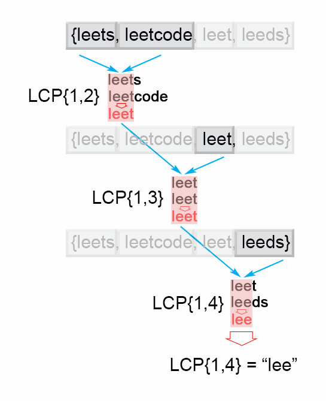

# [One Week Study Guide](../readme.md)

## 14. Longest Common Prefix

Easy

Write a function to find the longest common prefix string amongst an array of strings.

If there is no common prefix, return an empty string "".

### Example 1

**Input**: strs = ["flower","flow","flight"]  
**Output**: "fl"

### Example 2

**Input**: strs = ["dog","racecar","car"]  
**Output**: ""  
**Explanation**: There is no common prefix among the input strings.

**Constraints**:

- 1 <= strs.length <= 200
- 0 <= strs[i].length <= 200
- strs[i] consists of only lowercase English letters if it is non-empty.

### First Attempt (Wrong)

```Python
class Solution:
    def longestCommonPrefix(self, strs: List[str]) -> str:

        prefix = strs[0]
        for i in range(1, len(strs)):
            for j in range(len(strs[i])):
                if prefix in strs[:j]:
                    prefix = strs[:j]
                j += 1
        return prefix
```

### Approach 1: Horizontal scanning

#### Intuition

For a start we will describe a simple way of finding the longest prefix shared by a set of strings LCP(S1​…Sn​).
We will use the observation that :

LCP(S1​…Sn​)=LCP(LCP(LCP(S1​,S2​),S3​),…Sn​)

#### Algorithm

To employ this idea, the algorithm iterates through the strings [S1…Sn], finding at each iteration i the longest common prefix of strings LCP(S1…Si) When LCP(S1…Si) is an empty string, the algorithm ends. Otherwise after n iterations, the algorithm returns LCP(S1…Sn).


Figure 1. Finding the longest common prefix (Horizontal scanning)

### Solution (From Solution)

```Python
class Solution:
    def longestCommonPrefix(self, strs: List[str]) -> str:
        if len(strs) == 0:
            return ""

        prefix = strs[0]
        for i in range(1, len(strs)):
            while strs[i].find(prefix) != 0:
                prefix = prefix[0 : len(prefix) - 1]
                if prefix == "":
                    return ""
        return prefix
```
