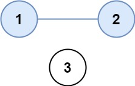

# [One Week Study Guide](../one-week-intervew-study-guide.md)

## 547. Number of Provinces

```txt
Solved
Medium

There are n cities. Some of them are connected, while some are not. If city a is connected directly with city b, and city b is connected directly with city c, then city a is connected indirectly with city c.

A province is a group of directly or indirectly connected cities and no other cities outside of the group.

You are given an n x n matrix isConnected where isConnected[i][j] = 1 if the ith city and the jth city are directly connected, and isConnected[i][j] = 0 otherwise.

Return the total number of provinces.


Example 1:



Input: isConnected = [[1,1,0],[1,1,0],[0,0,1]]
Output: 2
Example 2:


Input: isConnected = [[1,0,0],[0,1,0],[0,0,1]]
Output: 3


Constraints:

1 <= n <= 200
n == isConnected.length
n == isConnected[i].length
isConnected[i][j] is 1 or 0.
isConnected[i][i] == 1
isConnected[i][j] == isConnected[j][i]
```

### Solution

```Python
class Solution:
    def findCircleNum(self, isConnected: List[List[int]]) -> int:
        seen = set()
        graph = defaultdict(list)

        num_provinces = 0
        n = len(isConnected)

        for node in range(n):
            for neighbor in range(1, n):
                if isConnected[node][neighbor]:
                    graph[node].append(neighbor)
                    graph[neighbor].append(node)

        def dfs(node):
            for neighbor in graph[node]:
                if neighbor not in seen:
                    seen.add(neighbor)
                    dfs(neighbor)

        for node in range(n):
            if node not in seen:
                dfs(node)
                # don't forget to add the node to the seen set here. always forget
                seen.add(node)
                num_provinces += 1

        return num_provinces
```
