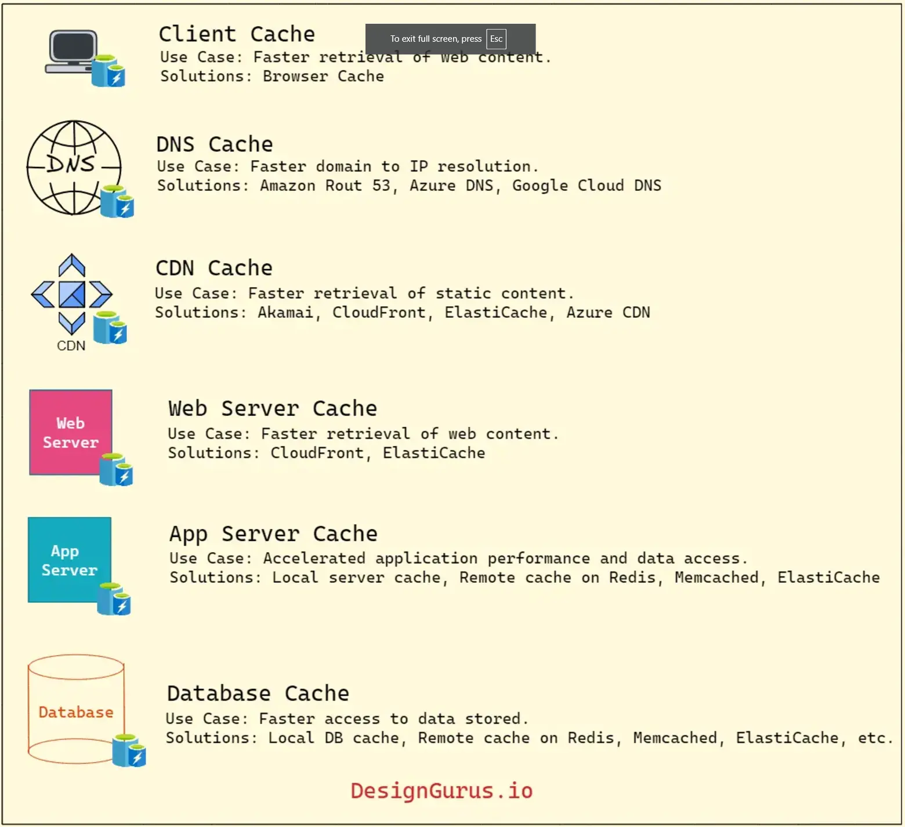
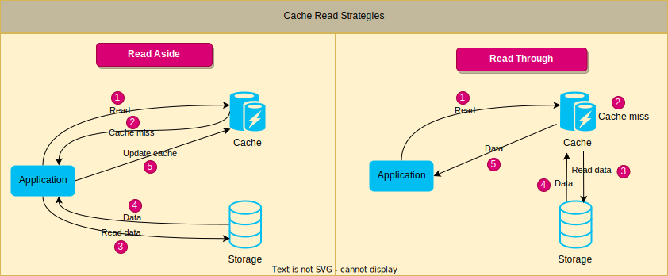

# Caching

Load balancing helps you scale horizontally across servers but caching helps you make better use of resources you already have as well as making otherwise unatainable product requriements feasible.

Locality of reference principle: recently requested data is likely to be requested again

Used in every computing layer:

- hardware
- operating systems
- web browsers
- web applications
- more

## What is Caching

High speed storage layer that sits between the application and the original source of the data (database, file system, remote web service). When the data is requested by the application it's first checked in the cache. if the data is not found it is retrieved from the original source and then stored in the cache for future use.

The goal is to reduce the number of times data is fetched from the original source.

Results in faster processing and reduced latency

- in-memory caching
- disk caching
- database caching
- CDN caching

### Terminology

- **Cache:** temporary storage location for data or computation results, typically for fast access and retrieval
- **Cache Hit:** requested data or computation result is found in the cache
- **Cache Miss:** requested data or computation result is not found in the cache and needs to be retrieved from the original source or recomputed
- **Cache Eviction:** removing data from the cache typically to make room for new data or a predefined cache eviction policy
- **Cache Staleness:** when data in the cache is outdated compared to the original data source

## Types of Caching

1. In-Memory Caching: stored data on the local main memory of the computer, faster to access than disk for data that can fit into memory.
   1. Commonly used for API responses, session data, web page fragments.
   2. Implemented using a cache library like `Memcached` or `Redis` or implementing custom caching logic within the application code
2. Disk Caching: slower than in-memory but faster than retrieving from a remote data source.
   1. Useful for data that is too large to fit in memory or if data needs to persist in between application restarts.
   2. caching database queries and file system data
3. Database Caching: stores frequently accessed data in the database itself
   1. Useful for data that is stored in the database and accessed by multiple users
   2. implemented in a variety of techniques including `database query caching` and `result set caching`
4. Client-side Caching: occurs on the client side such as web browser or mobile app
   1. stores frequently accessed data like images, CSS or javascript files
   2. browser caching or local storage
5. Server-side Caching: Typically in web applications or other backend systems
   1. store frequently accessed data, precomputed results, or intermediate processing results to improve performance of the server
   2. examples include full-page caching, fragment caching, object caching
6. CDN Caching: stores data on a distributed network of servers , reducing latency from remote locations
   1. useful for data accessed from multiple locations around the world; images, videos, other static assets
   2. commonly used for content delivery networks and large-scale web applications
7. DNS Caching: stores results of DNS queries for a period of time. user tries to resolve website's domain name to IP address. DNS server response with the IP address and user can access website through IP Address.
   1. Request for domain name, DNS server first goes to the cache, can then respond without having to query other servers for the IP address
   2. can significantly reduce response time for DNS queries and improve overall system performance

## Cache Invalidation

Caching can improve performance, still need to ensure data in the cache is correct, otherwise we serve stale information.

### Why Cache Invalidation

1. Ensure Data freshness:
   1. when underlying data changes, you must mark or remove old cached data so users don't see stale information
   2. without invalidation cache will continue to serve outdated data and lead to inconsistencies
2. Maintain System Consistency:
   1. large systems often have multiple caching layers. if one serves new data and other serves old data user will get conflicting data
   2. invalidating cache at each layer helps maintain consistent view of your system state
3. Balance performance and accuracy:
   1. Cache invalidation strategies (eg: time to live/TTL, manual triggers, event based) are designed to minimize the performance cost of continuously "refreshing" the cache
   2. the goal is to keep data as accurate as possible while still benefiting from high-speed data retrieval
4. Reduce Errors and mismatched states:
   1. stale cache risk presenting users with wrong or invalid results (ex: displaying out of stock product)
   2. strategically invalidating cache when data changes you reduce odds of users experiencing buggy or contradictory behavior

### Cache Write Strategies

1. Write-through

   1. Data is written to the cache and the database simultaneously.
   2. Higher latency for the user in write operations

2. Write-around

   1. Data is written directly to the database, skipping the cache entirely
   2. Can be used when bulk writes are needed and won't be read back
   3. Reads will produce a cache miss

3. Write-back
   1. Data is written to the cache
   2. after a period of time or under certain conditions data is written to the database
   3. can cause loss of data if cache server crash

### Cache Invalidation Methods

1. Purge

   1. removes cached content typically when there is an update or change
   2. when purge is received content is immediately removed
   3. next read request will update cache

2. Refresh

   1. updates cache with latest version from the origin server
   2. unlike purge no data is removed

3. Ban

   1. invalidates cached content based on criteria (pattern or header)
   2. content is immediately removed
   3. all subsequent requests will go to origin

4. Time-to-live (TTL) expiration

   1. when request is received, cache checks time-to-live and serves content only if value hasn't expired
   2. if expired cache fetches latest version from origin server and refreshes cache

5. Stale-while-revalidate
   1. used in web browsers and CDNs to serve stale content from the cache while content is being updated in the background
   2. request is received, cache immediately returns data while refreshing cache in the backgroundf
   3. low latency even if cache is out of date

### Cache Read Strategies

1. Read through

   1. Cache is responsible for retrieving data from the underlying store when a cache miss occurs.
   2. Application requests data from the cache instead of the data store directly.
   3. If cache miss, cache retrieves data from the data store, updates cache, then returns the data
   4. Maintains consistency
   5. Simplifies application code since application doesn't need to handle cache miss
   6. improve performance in scenarios where data retrieval from data store is expensive and cache misses are infrequent

2. Read aside (cache-aside, lazy loading)
   1. application is responsible for retrieving data when a cache miss occurs
   2. application first checks cache
   3. on cache miss, retrieves data from data store and updates cache, then uses data
   4. provides better control, but adds complexity
   5. use when you need caching but also need to ensure a cache failure won't take down system (application can just go to the database).
   6. useful when the application wants to optimize cache usage based on specific data access patterns

### Cache eviction policies

1. First In First Out (FIFO) - Discards first block inserted without regard to how often or how many times it was accessed
2. Last In First Out (LIFO) - Discards last block inserted without regard to how often or how many times it was accessed
3. Least Recently Used (LRU) - Discards least recently accessed
4. Most Recently Used (MRU) - Discards most recently accessed
5. Least Frequently Used (LFU) - count how often an item is accessed, least often are discarded first
6. Random Replacement (RR) - randomly selects item to discard to make space when necessary
