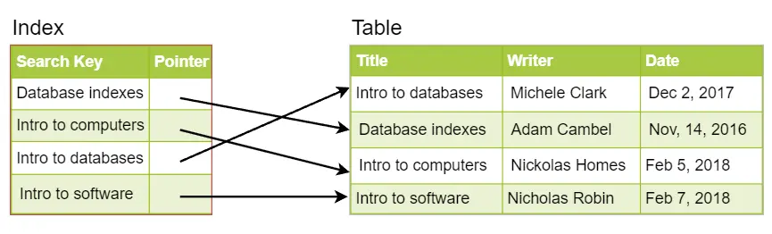

# Indexes

An internal to the database mechanism, generally stored on disk that improves performance of reads for random lookups and ordered records.

## Example

A library catalog could have two indexes one by book title and the other by writer name providing a sorted list of data, searchable by relevant information.

If we index by a column we are storing the column and an pointer to the whole row.

This works well if we are often doing searches by specific columns. `Must be careful how users are accessing the data`

Can be useful for large datasets with small payloads and/or when the data is spread over several physical devices.

# How indexes decrease performance

In heavy write scenarios you must go back and update the index (ex: data insertion/ update/delete).

Indexes that are no longer used should be removed.

For databases where you are writing often and rarely reading indexes should be avoided (ex: logging)
