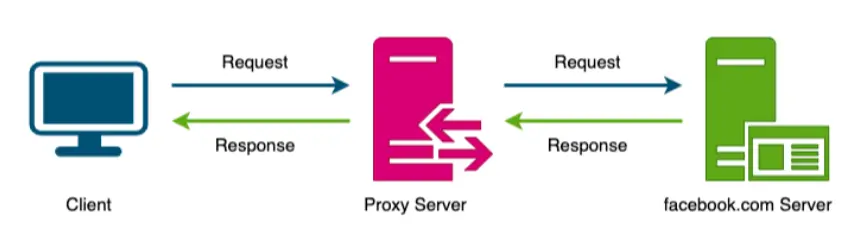
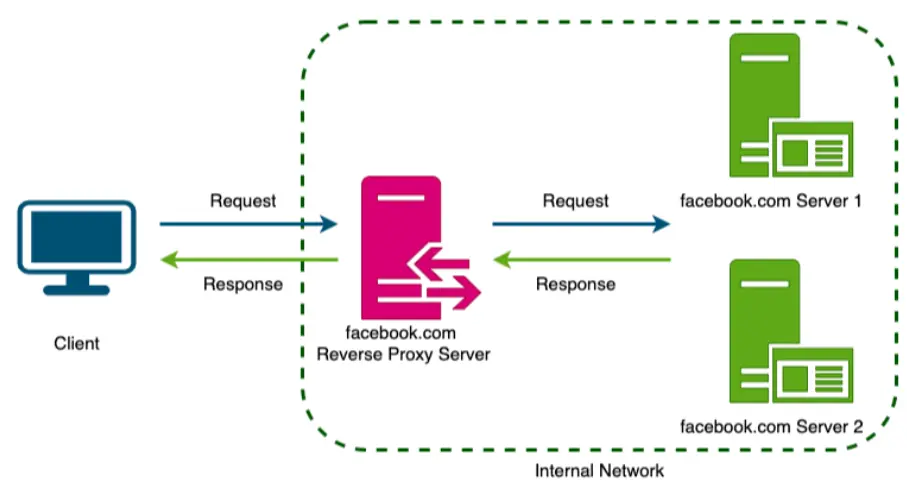

# Proxies

Sits between the client and the server facilitating the request for resources from other servers on behalf of clients.

## Forward Proxy

used to cache data, filter requests, log requests or transform requests (adding/removing headers, encrypting/decrypting, compressing)

can also be used to hide the identy of the client by sending requests to the server on behalf of the client

**Collapsed forwarding:** can also help to optimize requests by combining the same data access from multiple requests into one where that data is only read once but used in multiple requests (much like a cache)

## Reverse Proxy

retrieves resources from one or more servers for a client appearing to come from one server. hides the servers identity

can be used for caching, load balancing or routing requests to the appropriate servers

