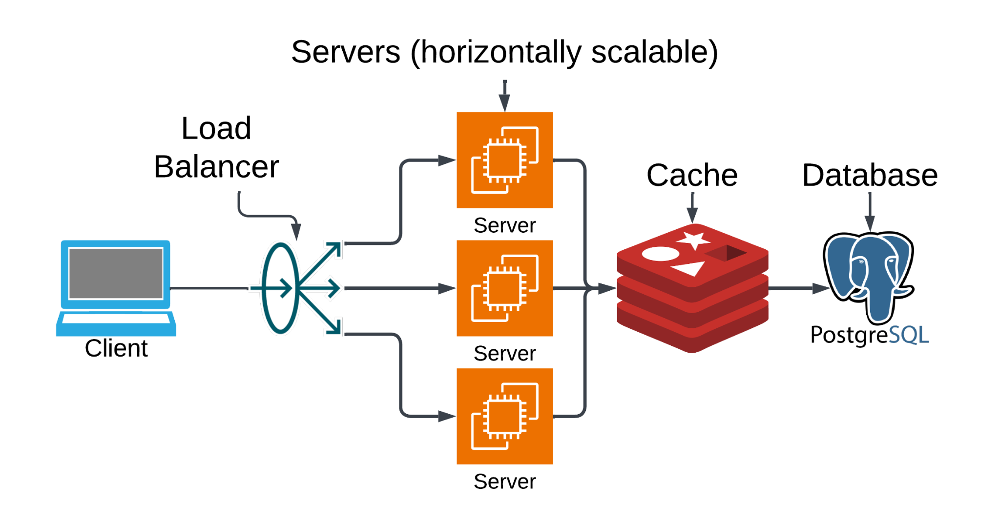

# 📝 System Design Whiteboard Template

## High Level

1. Clarify the prompt and restate it in your own words (1 minute)
   1. clarify misunderstandings
2. Gather functional requirements (3-5 minutes)
   1. if something is comfortable try to make that a functional requirement
3. Gather non-functional requirements (2-3 minutes)
   1. start here you can always adjust late in the design
   2. server design
   3. database design
4. Make estimates (3-5 minutes)
   1. Support 1,000 daily average instagram users
   2. Scroll for 10 minutes per day
   3. View 10 different posts per min
   4. Each user makes roughly 100 requests per day:
      1. 10 minutes × 10 requests/minute = 100 requests/day
   5. Given 100,000 users, that gives us 10,000,000 requests/day
      1. 100,000 users × 10 requests/user = 10,000,000 requests/day
   6. Assuming traffic is distributed equally, we can calculate TPS:
      1. TPS = 10,000,000 requests / 86,400 seconds ≈ 116 TPS
   7. If most of your users are in America, you can infer a peak TPS of ~1,000.
   8. In this case a single VM would handle this level of traffic.
5. Define the API contracts (3-6 min)
   1. If you are designing a single service or API, this is usually pretty quick, and can be a good way to demonstrate knowledge of things like RESTful API principles
6. Design the high level architecture (8-12 min)
   
7. Go deep on a single component (8-12 min)
   1. usually the database
      1. CP systems → Prioritize consistency (but may return errors under network issues)
      2. AP systems → Prioritize availability (but may return stale or eventually consistent data)
      3. Relational Databases (RDBMS)
         1. ACID-compliant, meaning they guarantee atomicity, consistency, isolation, and durability, making them ideal for systems that require strong data integrity and transactional safety.
         2. PostgreSQL, MySQL, and SQL Server
      4. Key-Value Stores
         1. simple and incredibly fast, built to retrieve values by a unique key with minimal overhead.
         2. DynamoDB, Redis, and Riak
      5. Document Stores
         1. Document databases store data as semi-structured documents, often in formats like JSON or BSON (binary JSON). flexibility allows you to trade between performance and consistency based on your needs
         2. MongoDB, Firebase, and Couchbase
      6. Wide-Column Stores
         1. organize data into column families like a giant two-dimensional hash map. great for high write throughput and large-scale workloads. prioritizing availability and partition tolerance while accepting eventual consistency. write availability is more important than up-to-the-second reads
         2. Cassandra, HBase, and Google Bigtable
      7. Graph Databases
         1. purpose-built for storing and traversing relationships between entities, using a structure of nodes and edges. how things are connected. some are designed to be CP, ensuring consistent graph views even under partition, while others can be tuned for AP characteristics to favor availability
         2. Neo4j and Amazon Neptune
8. Plan for scale and failure (3-6 min)
   1. “What happens if traffic spikes 10x overnight?”
   2. “What if a region goes down?”
   3. “What if the cache crashes?”
   4. Consider
      1. rate limiting, circuit breakers, multi-region failover, and built-in retries for failed requests.
9. Wrap it up with a high level summary (1 min)
   1. Highlight any key trade offs you made
   2. future extensions might look like if you had more time, or needed to support more features.

## Requirements

- **Functional:** What the system must do (features).
- **Non‑Functional:** Scale, latency, availability, durability, consistency, security.

---

## High‑Level Architecture

```txt
[ Client(s) ]
     |
     v
[ Load Balancer ]
     |
     v
[ Stateless App Servers ]  <-->  [ Cache Layer ]
     |
     v
[ Database(s) ]
     |
     v
[ Queue / Stream ]  --->  [ Workers / Consumers ]
     |
     v
[ Storage / External Services ]
```

---

## Key Components to Discuss

- **Clients:** Web, mobile, API consumers.
- **Load Balancer:** Distributes traffic, health checks.
- **App Servers:** Stateless, horizontally scalable.
- **Cache:** Reduce DB load, improve latency (Redis, Memcached, CDN).
- **Database:**
  - SQL (transactions, strong consistency).
  - NoSQL (scale, flexible schema).
  - Sharding / replication strategies.
- **Queue / Stream:** Smooth spikes, async processing (Kafka, SQS, RabbitMQ).
- **Workers:** Background jobs, batch processing.
- **Storage:** Blob store (S3, GCS) for media, backups.
- **Monitoring / Observability:** Metrics, logging, alerts.

---

## Trade‑Offs to Call Out

- **Consistency vs Availability** (CAP).
- **Latency vs Durability** (fast vs safe writes).
- **Cost vs Performance** (optimize ROI).
- **Monolith vs Microservices** (simplicity vs flexibility).
- **Read vs Write Optimization** (caching vs normalization).

---

## Interview Flow (RNL)

1. **Requirements** → Clarify scope.
2. **Numbers** → Estimate users, requests/sec, storage.
3. **Layout** → Draw architecture, explain choices.
4. **Deep Dive** → Pick one component (DB, cache, queue).
5. **Failure Modes** → What breaks, how to recover.
6. **Trade‑Offs** → Why you chose X over Y.

---

✅ With this template, you’ll always have a **default diagram** to start from, and you can adapt it to any prompt (chat app, feed, URL shortener, etc.).

---

Would you like me to **walk you through a dry‑run** using this template on a classic interview prompt (e.g., “Design a URL shortener” or “Design Instagram feed”) so you can see how to apply it step by step?
